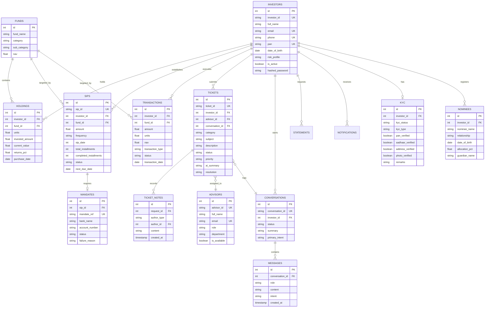

# Database Design & Schema — AURA Platform

AURA utilizes an SQL database architecture mapped using **SQLAlchemy 2.0 ORM** registries. Below is the Entity Relationship (ER) design and descriptions for all schema models.

---

## 📊 Entity Relationship Diagram

---

## 🗄️ Model Descriptions

### 1. `investors`
Stores primary profile details and login passwords for mutual fund clients.

### 2. `funds`
Catalog of supported mutual funds and their Net Asset Values (NAV).

### 3. `portfolio_holdings`
Represents client hold balances, purchase dates, unit details, and active yields.

### 4. `sips`
Defines recurring monthly plans withCycle Dates and installment details.

### 5. `mandates`
Maintains bank link authorization profiles and standard transaction rejection logs.

### 6. `kyc`
Tracks Pan/Aadhaar/Address linkages and audit markers.

### 7. `nominees`
Maintains family allocations and minor guardian mappings.

### 8. `conversations` & `conversation_messages`
Logs self-service session chat messages.

### 9. `service_requests` & `service_request_notes`
Handles escalations, internal advisor annotations, and tickets timeline.
